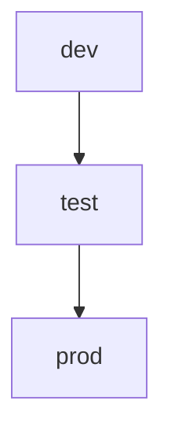

# prakriti.one 

A brief description of what this project does and who it's for developer


## Run Locally

Clone the project

```bash
  git clone https://link-to-project
```

Go to the project directory

```bash
  cd my-project
```

Install dependencies

```bash
  npm install
```

Start the server

```bash
  npm run start && npm start
```

[!WARNING]
[Change the prod branch to the ` dev `]


#### Environment Variables

To run this project, you will need to add the following environment variables to create your .env file

`API_URL : http://localhost:{port}`

`BASE_URL : http://localhost:{port}`

`FRONT_BASE_URL : http://localhost:{port} `

If the .env is create already then you comment the production .env variable and uncomment the localhost .env variable.


## Contributing

If you are setup the repository in `localhost` then you are starting the Contributing the code in project.

All repository have the a three branches :- 

- `prod (Default branch )  ---> production branch`

- `test ---> testing branch`

- `dev   ----> developer branch `

Developer are working on the `dev branch ` .
> [!NOTE]
> - The branch follow are working on the `dev`-->`test`-->`prod`


> [!NOTE]
> Add Extension in Vs code 

- [ GitHub pull request ](https://marketplace.visualstudio.com/items?itemName=GitHub.vscode-pull-request-github)
    * Handel for the issue assing 
    * start issue
    * handel pull requests


### How will developers view their issues ?

open the GitHub pull repository Extension and see 

- Issues
    - My Issues
        - No milestone
            - #1 issue title 

how to start the issue : - 


- click the arrow button in the end of issue  .
- 
- click to don`t fork and continou.
- After starting issues, a new branch will be created which is relevant to issues which will be generated from issue #11 or hashtag ID number. ex brach name : `username/issue1`.
- resolve the issue and commit and push .
-   go to the GitHub pull request Extension , and click the `create pull request` 

- pull request  to th base Branch ` dev `  its showing like   `  prakriti-0111/dev`

- set the base brach then click to the create .
- showing the pull request With new ID 

- after creating the pull request , the `dokploy preview deployments` start and start build the your code snd show the preview url. 

- After the  pull request accept delete the branch in local and origin  to redirect to dev branch .

- send the PR to  the `dev --> test --> prod` in using same process with without start the any issue .


#### This are the flow of the issue assing and resolve the developer .


### Flow of Branch are connected to the  deployments


